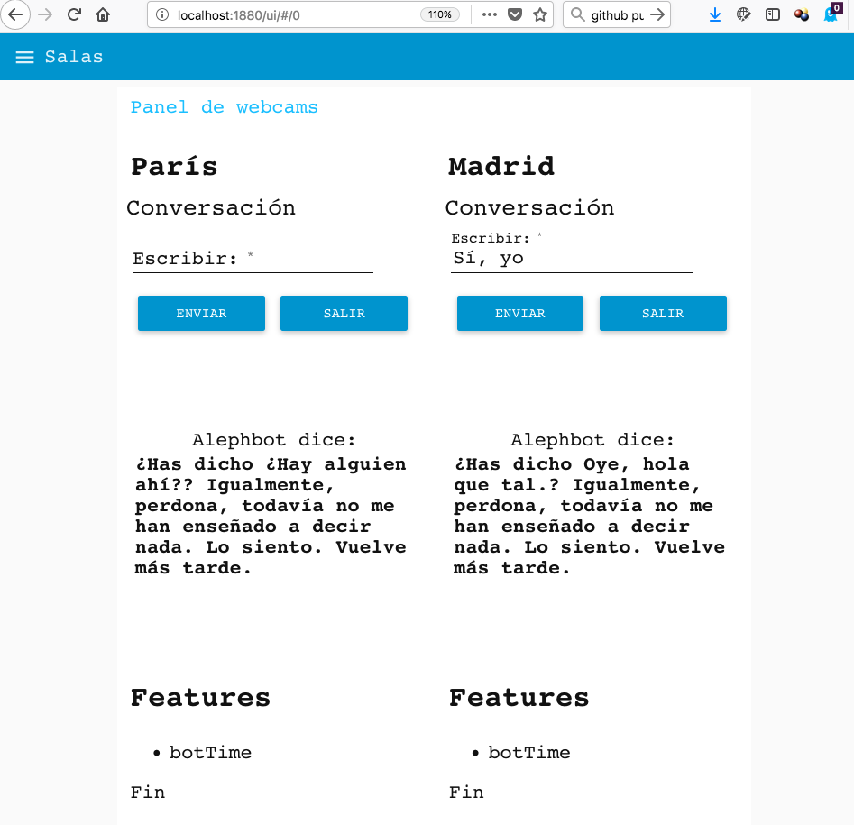
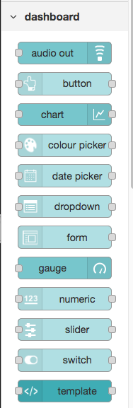
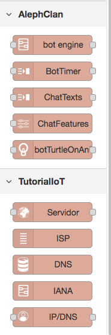
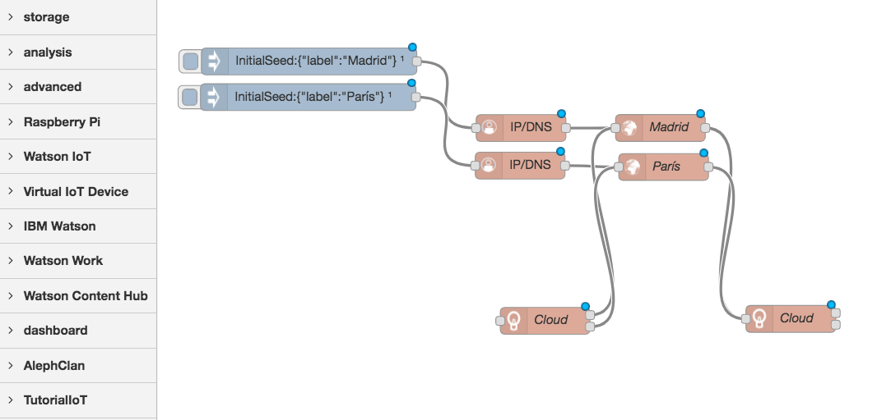
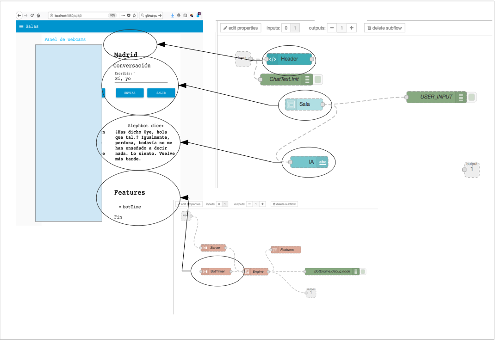
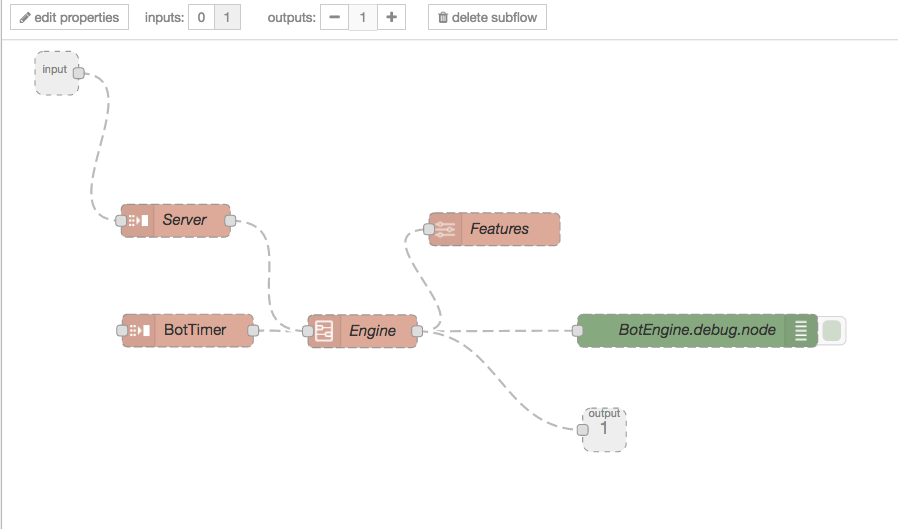
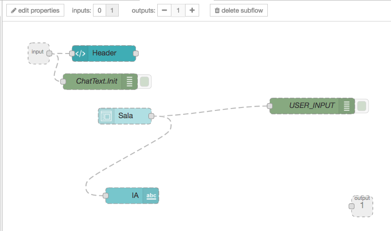

# What is this project?
A platform to hold debates. People and bots can talk on this online scenario.

# What you got until date?
- A bunch of nodes on Node-Red to build a webapp ui with two chat forms.
- Some implementation of a cloud

# What is inside here?
- Node-red export file (to be imported on your own node-red server)

# Explain the code
## FrontEnd
User sees a page with two groups. On the left, there is a pair to talk (one for human and human for bot. On the right, a clon, another instance. We can add here as many boxes as consider.

All this chats are represented on backend as a servers.

## Backend
On the backend, of course, we are using nodes:

... to build the user interface... but also nodes to do the transport layer...

Main flow is quite simple for two servers.

On image above you can see two servers, one from Madrid and one for Paris.

Each server consists on two other nodes: "The chat room & a feature-container"

The server is just a few bunch of nodes.

The chat is as much simple as that:

